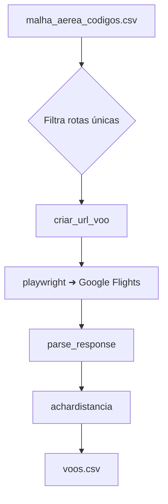

# DistVsPrice
Projeto final da disciplina de Extração Automática de Dados na Universidade Federal de Goiás.
 

Ferramenta para coletar e analisar a relação entre a **distância** das rotas aéreas e o **preço** de passagens. O projeto automatiza a busca de voos no Google Flights, calcula a distância entre aeroportos e salva os resultados em `datasets/voos.csv` para posterior análise.

## Instruções de execução

1. Tenha **Python 3.11+** instalado.
2. Instale as dependências definidas em `pyproject.toml`:
   ```bash
   pip install -e .
   playwright install
   ```
3. Execute o script principal:
   ```bash
   python main.py
   ```
   Os resultados serão salvos em `datasets/voos.csv`.

## Diagrama resumido do pipeline



## Dependências principais

- `beautifulsoup4`
- `lxml`
- `matplotlib`
- `pandas`
- `playwright`
- `protobuf`
- `requests`
- `seaborn`
- `selectolax`

Todas estão listadas em [`pyproject.toml`](./pyproject.toml).

## Datasets

- [`malha_aerea.csv`](./datasets/malha_aerea.csv) – malha aérea utilizada para gerar as rotas.
- [`malha_aerea_codigos.csv`](./datasets/malha_aerea_codigos.csv) – versão com códigos IATA/ICAO.
- [`voos.csv`](./datasets/voos.csv) – resultados obtidos pelo scraper.

## Conformidade e ética

O `robots.txt` público do Google determina diversas regras de acesso. Esta aplicação navega apenas por URLs permitidas pelo documento e aguarda intervalos razoáveis entre as requisições.

Já o site [`flightmanager.com`](https://www.flightmanager.com/) não possui `robots.txt`, e, por isso, utiliza-se apenas informações já apresentadas publicamente.

Todas as etapas do projeto respeitam a LGPD.

## Licença e fontes

Distribuído sob a licença MIT.

Os preços são obtidos do **Google Flights** e as distâncias são calculadas a partir de dados de [`flightmanager.com`](https://www.flightmanager.com/).

Os arquivos de malha aérea foram obtidos de fontes públicas de companhias aéreas brasileiras.
Distribuído sob a licença MIT. As informações da malha aérea foram obtidas no site da [Gol Linhas Aéreas](https://www.voegol.com.br/voos-gol), e os códigos IATA/ICAO foram complementados com auxílio de LLM.

Os preços são obtidos do **Google Flights** e as distâncias são calculadas a partir de dados de [`flightmanager.com`](https://www.flightmanager.com/).

A geração de url para busca no Google Flights foi utilizando a lógica existente no repositório [AWeirdDev/flights](https://github.com/AWeirdDev/flights). 

Todas as etapas seguem a LGPD e as permissões públicas de cada serviço.