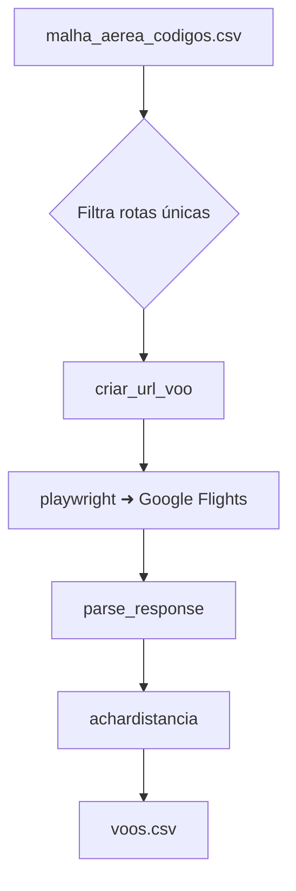

# DistVsPrice
 

Ferramenta para coletar e analisar a relação entre a **distância** das rotas aéreas e o **preço** de passagens. O projeto automatiza a busca de voos no Google Flights, calcula a distância entre aeroportos e salva os resultados em `voos.csv` para posterior análise.

## Instruções de execução

1. Tenha **Python 3.11+** instalado.
2. Instale as dependências definidas em `pyproject.toml`:
   ```bash
   pip install -e .
   playwright install
   ```
3. Execute o script principal:
   ```bash
   python main.py
   ```
   Os resultados serão salvos em `voos.csv`.

## Diagrama resumido do pipeline



## Dependências principais

- `beautifulsoup4`
- `lxml`
- `pandas`
- `playwright`
- `protobuf`
- `requests`
- `selectolax`

Todas estão listadas em [`pyproject.toml`](./pyproject.toml).

## Datasets

- [`malha_aerea.csv`](./malha_aerea.csv) – malha aérea utilizada para gerar as rotas.
- [`malha_aerea_codigos.csv`](./malha_aerea_codigos.csv) – versão com códigos IATA/ICAO.
- [`voos.csv`](./voos.csv) – resultados obtidos pelo scraper.

## Licença e fontes

Distribuído sob a licença MIT. Os preços são obtidos do **Google Flights** e as distâncias são calculadas a partir de dados de [`flightmanager.com`](https://www.flightmanager.com/). Os arquivos de malha aérea foram obtidos de fontes públicas de companhias aéreas brasileiras.